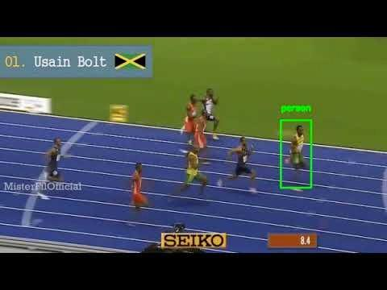
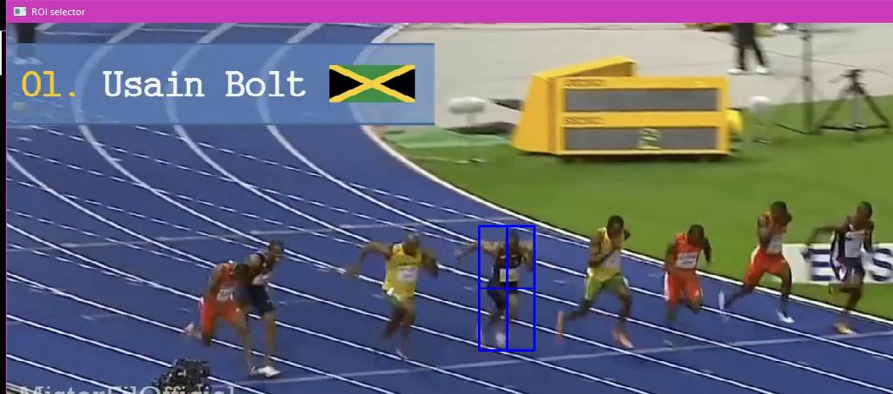
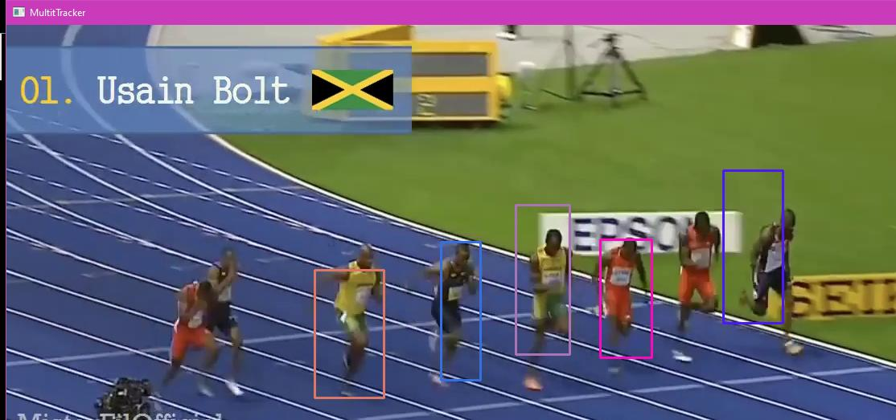

# Object Tracking Using OpenCV and Machine Learning

## Introduction

Object tracking is a fundamental task in computer vision that involves estimating the motion of an object over time within a video sequence. In this assignment, the objective is to implement object tracking using OpenCV and machine learning techniques. The tracking algorithm detects an object in the first frame of the video and continues to track it throughout the video sequence. This readme provides an overview of the concepts, techniques, and algorithms used in the implementation.

  
*Figure 1: Object Tracking*

## Theory

### Single Object Tracking (SOT)

Single Object Tracking aims to track a single object class throughout a video sequence. It involves defining a bounding box around the target object in the first frame, which is then used to locate the object in subsequent frames. Various algorithms such as BOOSTING, MIL, KCF, CSRT, Median Flow, and GOTURN can be used for single object tracking.

### Multiple Object Tracking (MOT)

Multiple Object Tracking refers to tracking multiple objects of interest in a video sequence. It involves detecting the number of objects in each frame and maintaining their identities across frames. This approach is crucial for applications like self-driving cars. MOT algorithms track each object individually from one frame to the next.

## Algorithms

1. **BOOSTING**: A simple algorithm based on the Haarcascade classifier, commonly used for face and object detection in OpenCV. It employs online learning and positive and negative image concepts.

2. **MIL (Multiple Instance Learning)**: MIL is a variation of supervised learning where labels are assigned to bags of instances rather than individual instances. It is suitable for problems with incomplete knowledge about training labels.

3. **KCF (Kernel Correlation Filter)**: KCF is a fast tracking algorithm that extends MIL, providing improvements and considering overlapping regions.

4. **CSRT (Discriminative Correlation Filter with Channel and Spatial Reliability Tracker)**: CSRT is a lower-level algorithm that uses discriminative filters, HOG techniques, and random markov tests for object tracking.

5. **Median Flow**: This algorithm tracks objects in both forward and backward directions, measuring differences between trajectories.

6. **GOTURN (Generic Objects Tracking Using Regression Networks)**: An offline learning algorithm based on deep learning and convolutional neural networks. It predicts the object's location in the next frame.

## Implementation

### Single Object Tracking

In the proposed implementation, a video or webcam feed is provided as input. The user selects the object to track, and a bounding box is created around it using the chosen algorithm. The object is then tracked throughout the video.

  
*Figure 2: Single Object Tracking*

### Multiple Object Tracking

Similar to single object tracking, multiple object tracking involves selecting objects from a video feed and tracking them simultaneously. Each object is assigned a unique bounding box, and different colors are used to differentiate between them.

  
*Figure 3: Multiple Object Tracking*

## Conclusion

The implemented object tracking system successfully tracks objects in video sequences. Among the algorithms tested, CSRT demonstrated precise and accurate tracking performance. While numerical accuracy calculation is challenging due to the dynamic nature of video sequences, practical observation confirms the effectiveness of the tracking algorithms.

